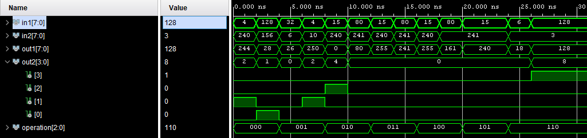

# VHDL ALU (Arithmetic Logic Unit)

## Introduction

Following INSA Lectures, making an ALU has been requested to learn the basics of VHDL.
In this repository you can find two `.vhd` files :
  - `alu.vhd` which is the core ALU written in VHDL
  - `sim_alu.vhd` the test component of the ALU


_Simulation Testing_

## Compiling

Because each VHDL files are using proprietary IEEE libraries, you may not be able to compile these files with GHDL.
However, you can use Xillinx Vivado or other VHDL compilers that are not open sources.

## Flags

Each Flags correspond to a certain operation, They are directly connected with the corresponding operation and may not mean something for others.

|Flag|Bit|Meaning|
|:--|:-:|:--|
|C (Carry)|0|In an addition, flag raised if the addition results in a number superior to 8 bits.|
|N (Negative)|1|In an addition or a subtraction, flag raised if the result is negative. Can be a false positive in the context of an addition if using unsigned numbers. In the context of a subtraction, inform if the number receive can be negative, even for unsigned numbers (for example 4-10).|
|Z (Zero)|2|Flag raised if the results equal to zero. Useful for IF statement.|
|O (Overflow)|3|In a multiplication, flag raised if the result is superior to 8 bits.|

## Deleted Code

### Multiplication Overflow/Negative

I had the idea to detect the overflow flag by checking if the returned sign corresponds to the multiplication between the two inputs. However, it didn't work as intended because a number can be both interpreted as signed/unsigned. For example `128` and `-128` are both `0b10000000` in binary. But if we want to raise our flags, in the first case only the overflow will be raised (in the case of 128*3 for instance), and in the second overflow and negative.

Here is the code I wanted to try :

```vhdl
-- If we multiply both a negative and positive value we should get a negative outcome
-- If we get a negative outcome but the multiplication should result in a positive we get an overflow
if ((SIGNED(a) < 0) XOR (SIGNED(b) < 0)) AND ((SIGNED(buffer_s_16) < (-128)) OR (SIGNED(buffer_s_16) > 127)) then
    buffer_flags(3) := '1';
elsif ((SIGNED(a) < 0) XOR (SIGNED(b) < 0)) AND (SIGNED(buffer_s_16) < (-128)) then
    buffer_flags(3) := '1';
end if;
```

Unfortunately, I had to remove all of this and replace it by a simple if statement that checks for an overflow on the 16 bits internal variable. Without even taking care of signed cases.